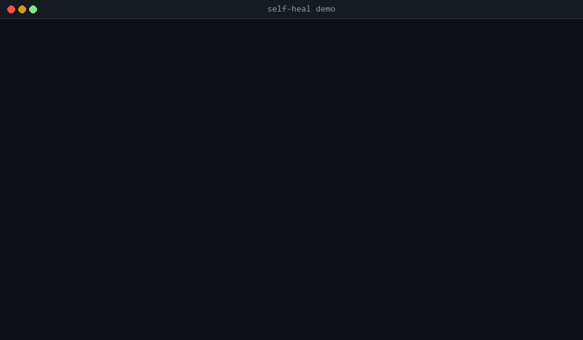

# self-heal

[](https://github.com/Johin2/self-heal/actions/workflows/ci.yml)
[](https://pypi.org/project/self-heal-llm/)
[](https://pypi.org/project/self-heal-llm/)
[](LICENSE)

> Automatic repair for failing Python code, powered by any LLM.



`self-heal` catches failures, proposes an LLM-guided fix with memory of prior attempts, verifies it, and retries. Works with Claude, OpenAI, Gemini, and 100+ other providers. Sync and async. One decorator.

```python
from self_heal import repair

def test_dollars(fn): assert fn("$12.99") == 12.99
def test_rupees(fn):  assert fn("₹1,299") == 1299.0
def test_euros(fn):   assert fn("€5,49") == 5.49

@repair(tests=[test_dollars, test_rupees, test_euros])
def extract_price(text: str) -> float:
    # Naive: only handles "$X.YY" with no commas
    return float(text.replace("$", ""))

extract_price("$12.99")   # triggers repair loop until ALL tests pass
```

## Benchmark

On 19 small Python tasks with plausible bugs (price parsing, palindrome, flatten, roman numerals, camelCase-to-snake_case, Levenshtein, anagram, duration formatting, ...), each task repaired against a hand-written test suite:

| Strategy | Tasks passed | Success rate | LLM calls |
|---|---:|---:|---:|
| Naive single-shot repair | 13 / 19 | 68% | 17 |
| **self-heal (multi-turn + memory)** | **19 / 19** | **100%** | 21 |

*Gemini 2.5 Flash, max 3 attempts, v0.2 harness. Reproduce: `self-heal bench --proposer gemini --model gemini-2.5-flash`. Full task list in [`benchmarks/tasks.py`](benchmarks/tasks.py).*

The 6 tasks where self-heal wins — `extract_price`, `is_palindrome`, `count_vowels`, `levenshtein`, `format_duration`, `is_anagram` — all share a pattern: the first proposed fix handles one edge case but misses another. Memory of the failed attempt plus test feedback lets the second proposal cover both. The remaining 4 extra LLM calls (21 vs 17) are the price for +6 tasks repaired — **~30% more calls for +46% more wins.**

## Install

`self-heal` ships with a Protocol and several optional adapters. Install the adapter(s) you want:

```bash
pip install 'self-heal-llm[claude]'    # Anthropic Claude (default)
pip install 'self-heal-llm[openai]'    # OpenAI + OpenAI-compatible endpoints
pip install 'self-heal-llm[gemini]'    # Google Gemini
pip install 'self-heal-llm[litellm]'   # 100+ providers via LiteLLM
pip install 'self-heal-llm[all]'       # everything
```

> PyPI distribution name is `self-heal-llm` (the short name `self-heal` was blocked by PyPI's similarity check with an unrelated package). The Python import stays `from self_heal import ...`.

## Provider support

| Adapter | Covers |
|---|---|
| `ClaudeProposer` | Anthropic Claude (native SDK) |
| `OpenAIProposer` | OpenAI + **any OpenAI-compatible endpoint** (OpenRouter, Together, Groq, Fireworks, Anyscale, Perplexity, xAI, DeepSeek, Azure, Ollama, LM Studio, vLLM, llama.cpp server, ...) |
| `GeminiProposer` | Google Gemini (native SDK) |
| `LiteLLMProposer` | 100+ providers via LiteLLM (Bedrock, Vertex, Cohere, Mistral, ...) |

## Features

### Multi-turn repair with memory
Every proposal sees the history of *prior failed attempts* so the LLM can't repeat the same mistake. This is the single biggest quality win over naive retry.

### Verifiers — `verify=callable`
Catch bad *return values*, not just exceptions:

```python
@repair(verify=lambda v: isinstance(v, float) and v > 0)
def extract_price(text): ...
```

If the predicate returns `False` or raises, self-heal treats it as a failure and repairs.

### Test-driven repair — `tests=[...]`
Give self-heal a test suite; it repairs until every test passes:

```python
def test_empty(fn):  assert fn("") is None
def test_dollar(fn): assert fn("$12.99") == 12.99

@repair(tests=[test_empty, test_dollar])
def extract_price(text): ...
```

### Async-native
The decorator auto-detects `async def` and awaits correctly; the LLM call runs in a thread pool so your event loop stays free.

```python
@repair()
async def fetch_and_parse(url: str) -> dict: ...
```

### Prompt customization — `prompt_extra="..."`
Append domain-specific instructions to every repair prompt. Useful for "always handle None inputs" or "use only the standard library."

### Bring your own LLM
Implement the `LLMProposer` Protocol (`def propose(self, system: str, user: str) -> str`) and pass it in.

### Repair cache — skip the LLM when you've seen it before
```python
from self_heal import repair

@repair(cache_path=".self_heal_cache.db")
def my_fn(...): ...
```
First repair hits the LLM. Subsequent identical failures are served from SQLite (zero latency, zero cost). Keyed on source hash + failure signature with whitespace and memory-address normalization.

### AST safety rails — block dangerous proposals
```python
@repair(safety="moderate")   # default off; "moderate" | "strict" | SafetyConfig(...)
def my_fn(...): ...
```
`moderate` rejects proposals that call `eval` / `exec` / `os.system`, import `subprocess` / `socket` / `pickle` / `ctypes`, or touch `__globals__` / `__class__` / other escape hatches. `strict` additionally forbids any non-whitelisted import.

### Progress callbacks
```python
from self_heal import repair, RepairEvent

def watch(event: RepairEvent):
    print(event.type, event.attempt_number)

@repair(on_event=watch)
def my_fn(...): ...
```
Hooks fire on attempt start, failure, propose start/complete, install, cache hit/miss, safety violation, verify, and repair completion — perfect for agent UIs and observability pipelines.

### pytest plugin — `pytest --heal`
Mark any test with `@pytest.mark.heal(target="mymod.my_fn")`. When it fails with `--heal`, self-heal loads the target, repairs it using the test as verification, and prints the proposed diff at the end of the session.

```python
import pytest
from mymod import extract_price

@pytest.mark.heal(target="mymod.extract_price")
def test_rupees():
    assert extract_price("₹1,299") == 1299.0
```
```bash
pytest --heal
```

### CLI — heal a function from the command line
```bash
self-heal heal mymod.py::extract_price \
    --test tests/test_mymod.py::test_rupees \
    --apply
```
Loads the function, runs self-heal with your pytest-style test as verification, prints a unified diff, and (with `--apply`) writes the fix back to the file.

## Why this exists

AI coding agents fail on a lot of real tasks. The industry's current answer is "retry and hope." That's not a strategy.

`self-heal` treats repair as a first-class primitive: diagnose the failure, propose a targeted fix with memory of prior attempts, verify, retry. A thin library you can wrap around any Python function or agent tool.

## How it works

1. **Catch** the exception (or verifier/test failure) and capture inputs, traceback, failure type.
2. **Classify** the failure (exception, verifier, test, assertion, validation).
3. **Propose** a repaired function via an LLM with a failure-aware prompt that includes the full history of prior failed proposals.
4. **Recompile** the proposed function into the running process.
5. **Verify** with user-provided verifier + tests.
6. **Retry** with the same inputs until success or `max_attempts` exhausted.

## API

```python
from self_heal import repair

@repair(
    max_attempts=3,
    model="claude-sonnet-4-6",
    proposer=None,               # or ClaudeProposer / OpenAIProposer / ...
    verbose=False,
    on_failure="raise",          # or "return_none"
    verify=None,                 # Callable[[Any], bool] — raise or False → repair
    tests=None,                  # list[Callable[[Callable], Any]]
    prompt_extra=None,           # str — extra user instructions in every prompt
)
def my_fn(...): ...

my_fn.last_repair   # RepairResult with full attempt history
my_fn.repair_loop   # the underlying RepairLoop
```

For advanced use:

```python
from self_heal import RepairLoop

loop = RepairLoop(max_attempts=5, verbose=True)
result = loop.run(my_fn, args=(...), verify=..., tests=[...])

# Async:
result = await loop.arun(my_async_fn, args=(...))
```

## Using different providers

**Claude (default):**
```python
@repair()
def my_fn(...): ...
```

**OpenAI:**
```python
from self_heal.llm import OpenAIProposer

@repair(proposer=OpenAIProposer(model="gpt-5"))
def my_fn(...): ...
```

**Gemini:**
```python
from self_heal.llm import GeminiProposer

@repair(proposer=GeminiProposer(model="gemini-2.5-pro"))
def my_fn(...): ...
```

**Any OpenAI-compatible endpoint (OpenRouter, Groq, Ollama, ...):**
```python
from self_heal.llm import OpenAIProposer

# OpenRouter — hundreds of models through one key
OpenAIProposer(
    model="google/gemini-2.5-pro",
    base_url="https://openrouter.ai/api/v1",
)

# Local Ollama
OpenAIProposer(
    model="llama3.3",
    base_url="http://localhost:11434/v1",
    api_key="ollama",
)
```

**LiteLLM catch-all (100+ providers):**
```python
from self_heal.llm import LiteLLMProposer

LiteLLMProposer(model="bedrock/anthropic.claude-3-5-sonnet")
LiteLLMProposer(model="vertex_ai/gemini-2.5-pro")
LiteLLMProposer(model="cohere/command-r-plus")
```

## Agent framework integration

`self-heal` composes with any Python agent framework. Wrap the tool's underlying callable with `@repair` and register the result as usual. Examples in [`examples/`](examples):

- [`with_claude_agent_sdk.py`](examples/with_claude_agent_sdk.py)
- [`with_openai_agents.py`](examples/with_openai_agents.py)
- [`with_langchain.py`](examples/with_langchain.py)

## Safety

`self-heal` executes LLM-generated code via `exec()` in the same process. Same trust boundary as any LLM-in-the-loop system: do not run against untrusted inputs without a sandbox. Sandboxed execution is on the roadmap.

## Roadmap

- [x] v0.0.1: core repair loop + decorator + Claude backend
- [x] v0.0.2: OpenAI, Gemini, LiteLLM adapters — works with any LLM
- [x] v0.1.0: multi-turn memory, verifiers, test-driven repair, async, benchmark harness
- [x] **v0.2.0: repair cache, AST safety rails, event callbacks, pytest plugin, CLI, extended benchmarks**
- [ ] v0.3: streaming token events + async proposers for Claude/OpenAI/Gemini
- [ ] v0.4: sandboxed execution (subprocess/wasm)
- [ ] v0.5: `pytest --heal --apply` for in-place file patching
- [ ] v1.0: stable API + extended benchmark suite (QuixBugs, HumanEval-Fix)

## Contributing

See [`CONTRIBUTING.md`](CONTRIBUTING.md) for the full guide: dev setup, everyday commands, how to add a new LLM proposer or benchmark task, and the PR checklist. Good first issues are tagged [here](https://github.com/Johin2/self-heal/issues?q=is%3Aopen+is%3Aissue+label%3A%22good+first+issue%22).

## Development (quick start)

```bash
git clone https://github.com/Johin2/self-heal.git
cd self-heal
python -m venv .venv
.venv/Scripts/pip install -e ".[dev]"   # Windows
# .venv/bin/pip install -e ".[dev]"     # macOS/Linux
pytest
ruff check .
```

Run the benchmark locally:
```bash
python benchmarks/run.py --proposer claude       # uses ANTHROPIC_API_KEY
python benchmarks/run.py --proposer openai       # uses OPENAI_API_KEY
python benchmarks/run.py --proposer gemini       # uses GEMINI_API_KEY
```

## License

MIT
